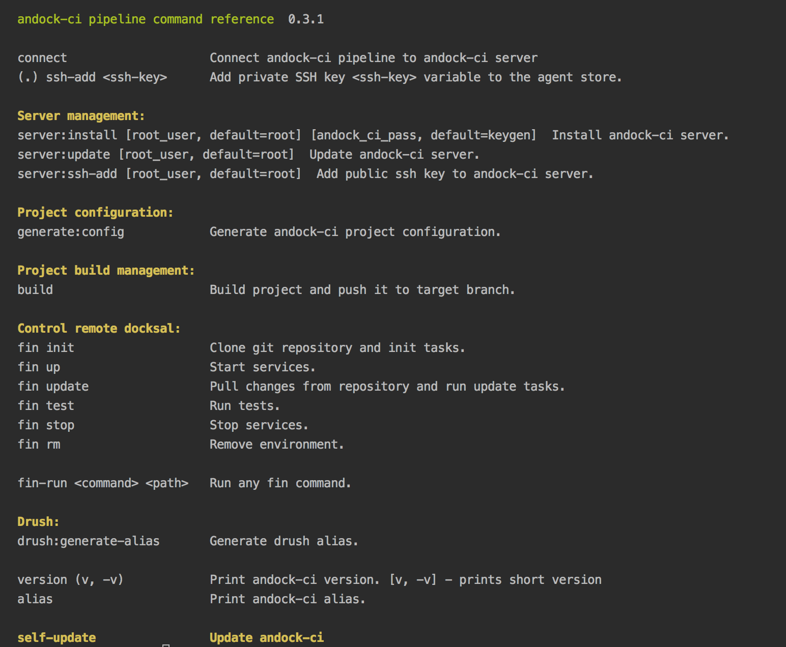

# andock - docksal and ansible powered hosting.

## Key features
* Easy to use command line tool.
* Use ansible to remote control docksal.
* Easy configuration.
* One environment per branch.
* Extendable with init, update, tests ansible hooks.
* drush support including drush sql-sync without extra ssh container.
* Easy to integrate in your CI environment.

## For what can you use andock?
* Host your project including environments support for every branch.
* Host your project on acquia, platform.sh etc. Use andock for unlimited development environment.
* Use andock to host review environments for qa suites. 

## How can I use andock
* As docksal addon
* As a docker image inside your CI
* As a standalone command line tool.

## Commands:

# Getting started?

* [See documentation](https://andock-andock.readthedocs.io/en/latest/)
* [5 minutes setup](https://andock-andock.readthedocs.io/en/latest/getting-started/docksal.md)
